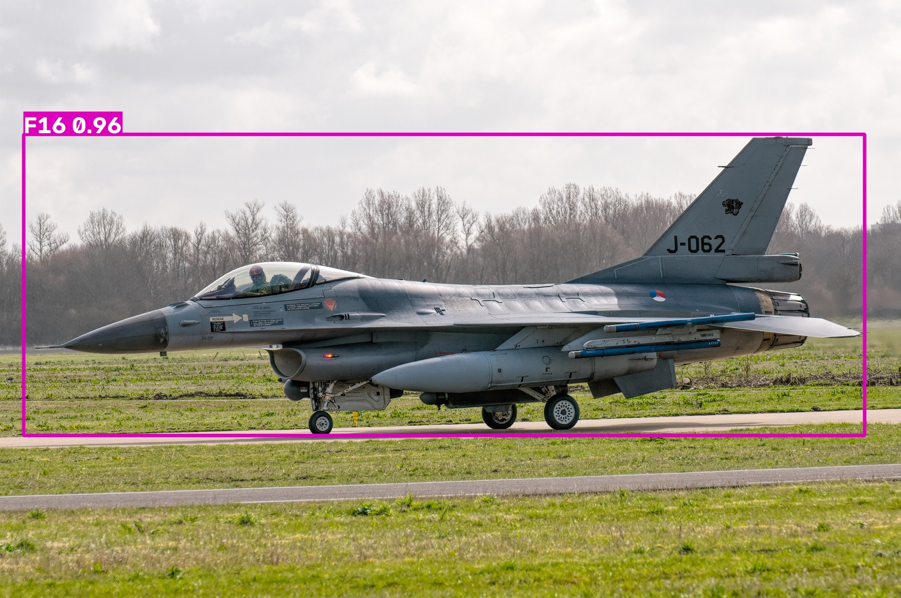

# Military Aircraft Detection (YOLOv8)


Real-time military aircraft detection and classification across **103 aircraft types** - fighters, bombers, transports, reconnaissance, UAVs, and helicopters - built on YOLOv8. Supports image, video, and webcam inference with a modular, testable pipeline: dataset preparation -> training -> evaluation -> inference.



## Contents
- [Overview](#overview)
- [Supported Aircraft](#supported-aircraft)
- [Pipeline](#pipeline)
- [Installation](#installation)
- [Dataset](#dataset)
- [Training](#training)
- [Evaluation](#evaluation)
- [Inference](#inference)
- [Testing](#testing)
- [Results](#results)
- [Project Structure](#project-structure)
- [Design Notes](#design-notes)
- [Known Issues](#known-issues)

## Overview
This project trains a YOLOv8 object detector to localize and classify military aircraft in still images and video, across the full 103-class taxonomy present in the source dataset. It covers the full applied-ML lifecycle rather than just a model file:

- **Data preparation**: converts a VOC-style annotated dataset (single `labels_with_split.csv` source of truth, with a pre-assigned train/validation/test split) into YOLO format.
- **Training**: configurable YOLOv8 fine-tuning (model size, epochs, image size, early stopping) via `scripts/train.py`.
- **Evaluation**: official Ultralytics `val()` metrics (mAP50, mAP50-95, precision, recall) on a held-out test split, plus an independent per-class AP report.
- **Inference**: unified `detect.py` CLI for images, video files, and a live webcam feed.
- **Testing & CI**: unit tests for the box-conversion math and metrics implementation, plus a GitHub Actions workflow.

## Supported Aircraft
103 classes total, including `F22` `F35` `F16` `F15` `F18` `F14` `F4` `B2` `B1` `B52` `F117` `SR71` `A10` `C130` `C17` `C5` `U2` `YF23` `XB70` `Su57` `Mig31` `Tu95` `Tu160` `J20` `Rafale` `EF2000` `JAS39` `Mirage2000` `V22` `MQ9` `RQ4` `E2` `AG600` `Be200` `US2` `A400M` and many more (helicopters, UAVs, and additional fighters/bombers/transports). The full canonical list of all 103 classes is defined in `data/classes.py`.

Some classes are naturally rare in the source dataset (e.g. `WZ9`: 13 images, `MQ20`: 16 images) and perform noticeably worse - see the [Results](#results) section for an honest per-class breakdown discussion.

## Pipeline
```
Raw dataset (labels_with_split.csv + images/)
   |  data/prepare_dataset.py  (VOC to YOLO box conversion, uses pre-assigned split column)
   v
data/images/{train,validation,test}
data/labels/{train,validation,test}
   |  scripts/train.py  (YOLOv8 fine-tuning)
   v
models/best.pt
   |
   +-- scripts/evaluate.py  ->  per-class AP, mAP, precision/recall
   +-- scripts/detect.py    ->  image / video / webcam inference
```

## Installation
```bash
git clone https://github.com/hritikbhattt/Military-Aircraft-Detection.git
cd Military-Aircraft-Detection
pip install -r requirements.txt
```
Python 3.8+ and PyTorch 2.0+ are required. A CUDA-capable GPU is strongly recommended for training (this project's model was trained on a Kaggle-hosted Tesla T4). CPU is sufficient for inference.

## Dataset
Trained on the [Military Aircraft Detection Dataset](https://www.kaggle.com/datasets/a2015003713/militaryaircraftdetectiondataset) (Kaggle). The dataset's `labels_with_split.csv` is the single source of truth - one row per bounding box, with columns `filename, width, height, class, xmin, ymin, xmax, ymax, split` - including a pre-assigned `train`/`validation`/`test` split.

```bash
python data/prepare_dataset.py --raw-dir /path/to/militaryaircraftdetectiondataset
python data/prepare_dataset.py --raw-dir /path/to/militaryaircraftdetectiondataset --limit-per-class 150
```

Full-dataset split sizes: **17,687 train / 4,361 validation / 1,572 test** images, across all 103 classes.

## Training
```bash
python scripts/train.py --epochs 40 --data data/data.yaml
```
Saves runs under `runs/detect/`, logs standard Ultralytics metrics/plots, and copies the best checkpoint to `models/best.pt`. Run `python scripts/train.py --help` for the full argument list.

## Evaluation
```bash
python scripts/evaluate.py --weights models/best.pt --data data/data.yaml --split test
```
Prints Ultralytics' official mAP50 / mAP50-95 / precision / recall on the chosen split, and saves a per-class AP bar chart to `outputs/eval/per_class_ap.png`.

## Inference
```bash
python scripts/detect.py --source test_files/image.jpg --weights models/best.pt
python scripts/detect.py --source test_files/video.mp4 --weights models/best.pt
python scripts/detect.py --source 0 --weights models/best.pt
python scripts/detect.py --source test_files/image.jpg --weights models/best.pt --conf 0.5 --play
```

## Testing
```bash
pip install -r requirements-dev.txt
python -m unittest discover -s tests -v
```
CI (`.github/workflows/ci.yml`) runs these on every push.

## Results
Evaluated on the held-out **test split** (1,572 images, never used during training or checkpoint selection):

| Metric | Value |
|---|---|
| mAP50 | 0.655 |
| mAP50-95 | 0.578 |
| Precision | 0.703 |
| Recall | 0.559 |
| Inference speed (GPU, Tesla T4) | ~5.8ms/image |

Trained for 40 epochs on the full 17,687-image training set (YOLOv8s, 640px, batch 16). Performance is strong on well-represented classes (`X32`: 0.96 mAP50, `C2`: 0.92, `US2`: 0.93) and noticeably weaker on classes with very few training examples (`B21`: 3 test images, `MQ28`: 3 test images) - a direct, expected consequence of class imbalance in the source dataset rather than a modeling flaw. Full per-class breakdown is generated by `scripts/evaluate.py`.

## Project Structure
```
military-aircraft-detection/
+-- .github/workflows/ci.yml
+-- assets/Screenshot-inference.png
+-- data/classes.py
+-- data/data.yaml
+-- data/metrics.py
+-- data/prepare_dataset.py
+-- data/generate_synthetic_samples.py
+-- scripts/train.py
+-- scripts/evaluate.py
+-- scripts/detect.py
+-- tests/test_classes.py
+-- tests/test_metrics.py
+-- models/best.pt
+-- test_files/
+-- requirements.txt
+-- requirements-dev.txt
+-- LICENSE
```

## Design Notes
- **103 vs. 36 classes**: an earlier scope draft targeted a 36-class subset; the decision was made to use the full 103-class taxonomy present in the source dataset instead, since the additional classes were already fully labeled and available at no extra cost.
- **Why a from-scratch metrics module alongside Ultralytics' own `val()`?** It's a correctness cross-check against Ultralytics' internal box-matching conventions.
- **Class imbalance is real and disclosed, not hidden**: several classes have under 20 total images. Results are reported honestly per-class rather than only as an aggregate mAP.

## Known Issues
- `scripts/evaluate.py`'s custom per-class report (separate from the main Ultralytics evaluation) currently errors on a formatting bug when generating its own table; the primary Ultralytics-reported metrics above are unaffected and reliable.
- `.github/workflows/ci.yml` is not currently passing; being investigated.